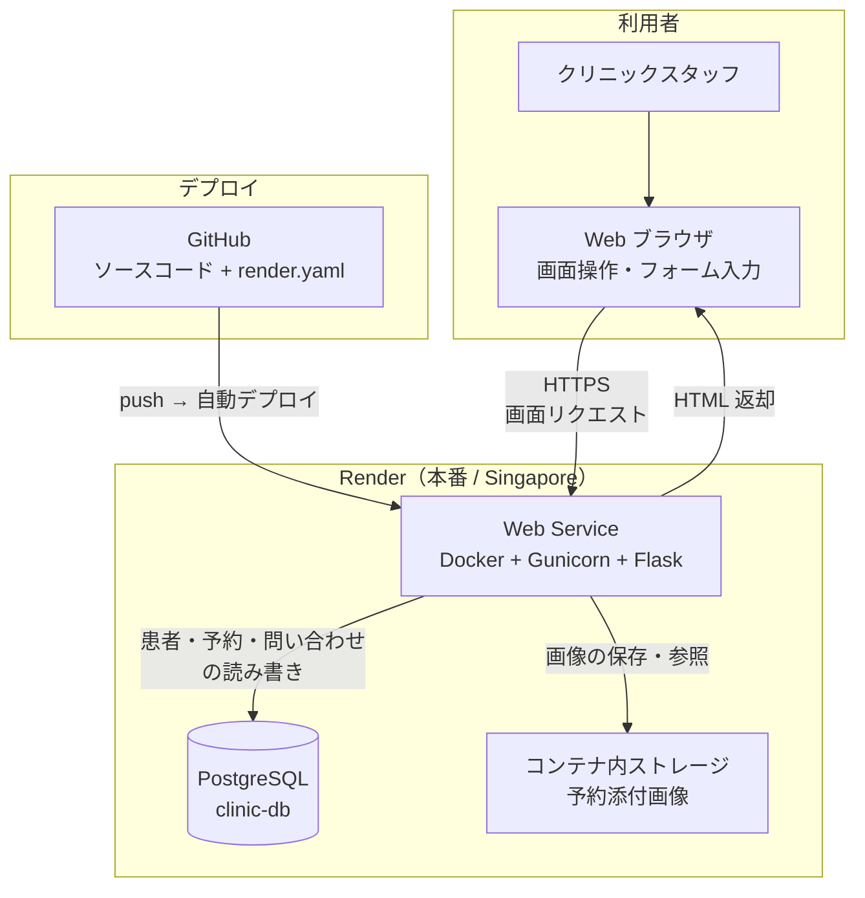
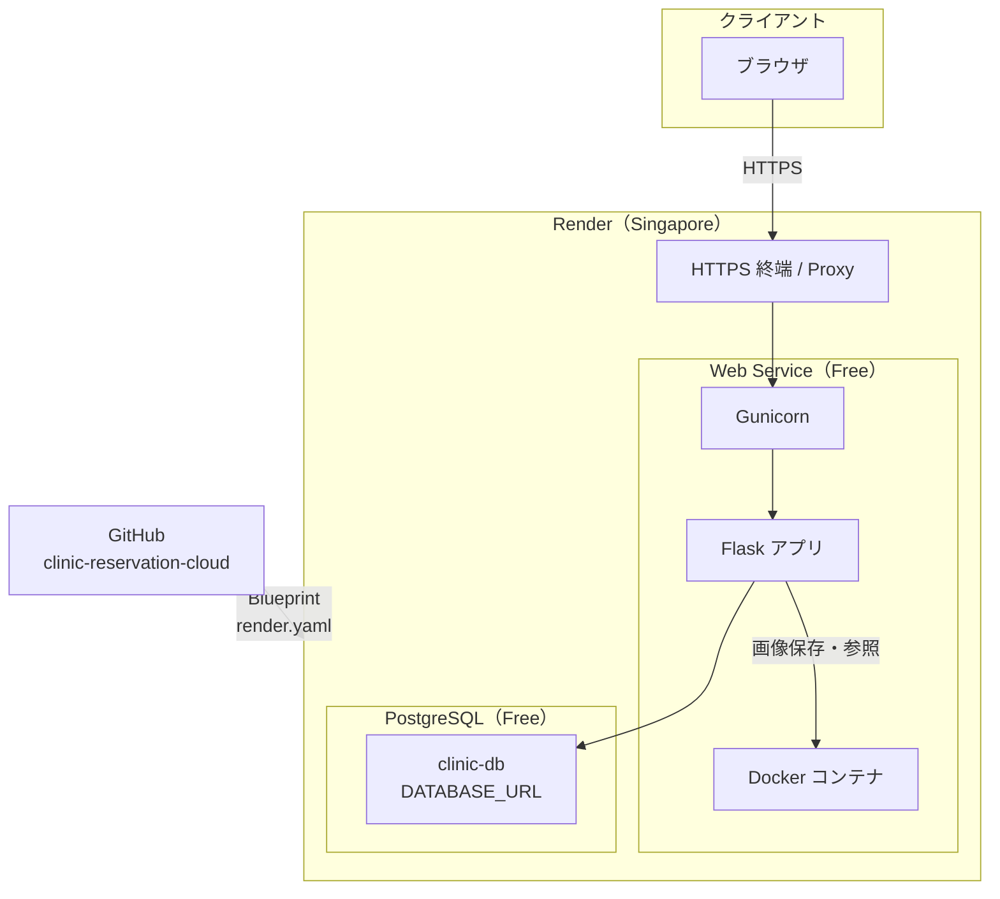
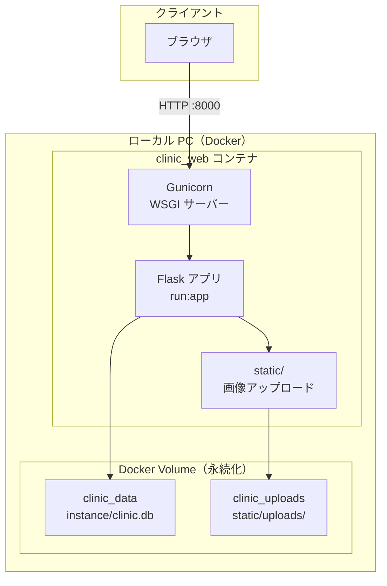
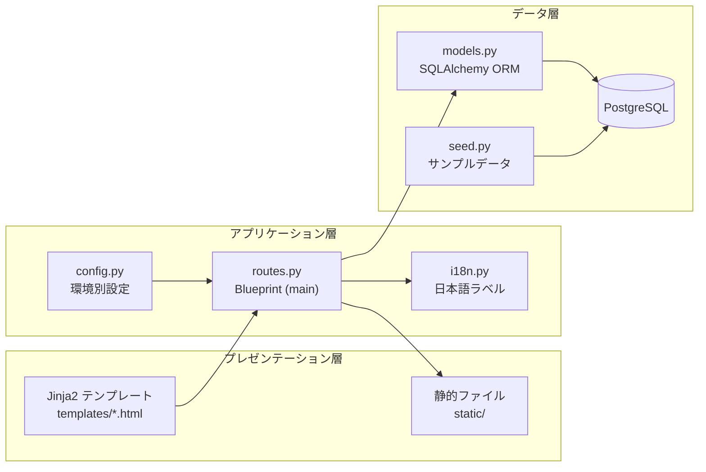
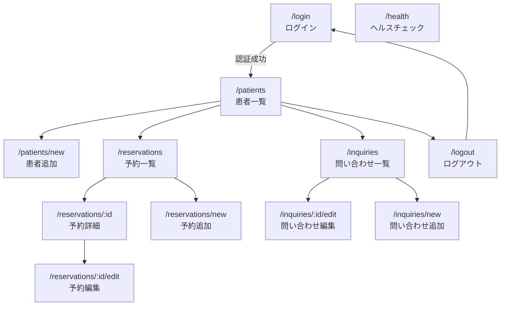
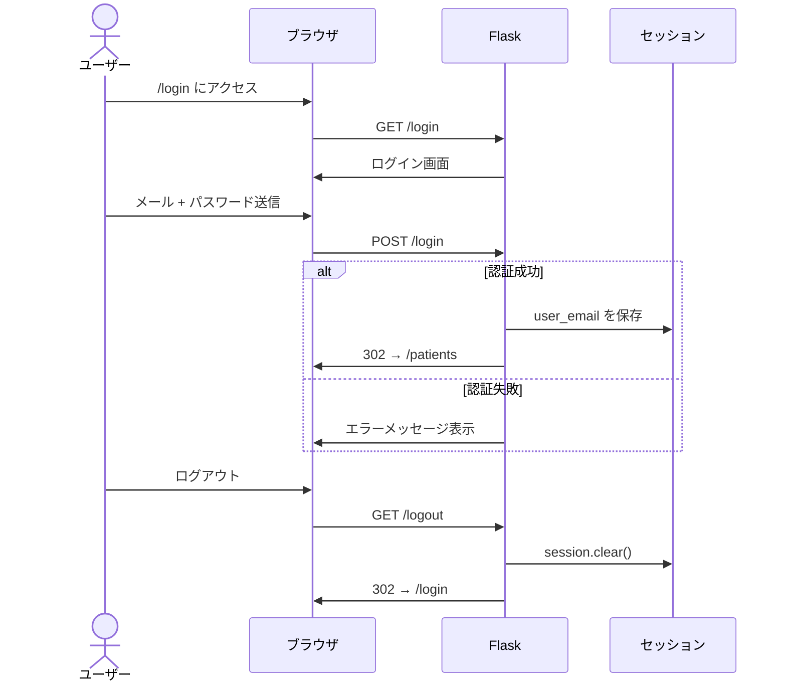
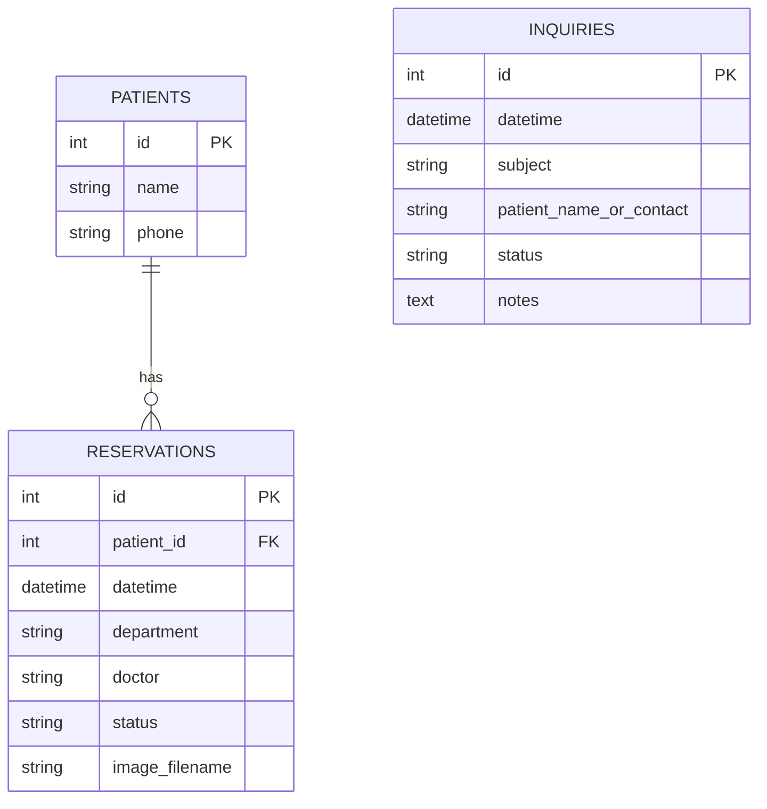
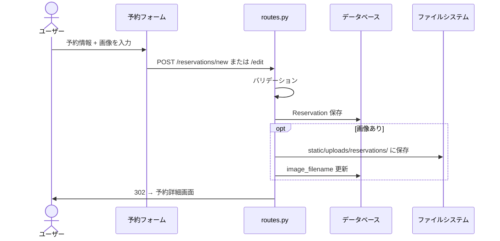

# システム構成図

クリニック予約・問い合わせ管理システム（clinic-reservation-cloud）のアーキテクチャです。  
**本番は Render（Web Service + PostgreSQL）で公開**し、ローカル Docker は開発・検証用とする。

---

## 1. 全体概要

### システムの目的

クリニックスタッフが **患者・予約・問い合わせ** を Web ブラウザから管理する社内システム。  
サーバー側で HTML を生成する **SSR（サーバーサイドレンダリング）** 構成とし、本番は **Render** 上で公開する。

### システム構成図



### 構成要素と役割

| 要素 | 役割 | 本システムでの役割 |
|------|------|-------------------|
| Web ブラウザ | 操作画面 | スタッフが患者一覧・予約・問い合わせを閲覧・登録・編集 |
| Flask | Web アプリ | 認証、入力チェック、DB 操作、HTML 生成 |
| Jinja2 | テンプレート | 一覧・フォームなど画面 HTML を組み立て |
| Gunicorn | Web サーバー | Flask を本番環境で常時起動・リクエスト受付 |
| PostgreSQL | リレーショナル DB | 患者・予約・問い合わせデータを永続保存 |
| ファイルストレージ | ファイル保存 | 予約に添付する画像を保存 |
| GitHub | ソース管理 | コード管理と Render へのデプロイ起点 |
| Render | クラウド PaaS | Web アプリと DB をホスティングし HTTPS で公開 |
| Docker | コンテナ | 本番・開発とも同一 Dockerfile で実行環境を統一 |

### 処理の流れ

1. スタッフがブラウザから HTTPS でアクセス
2. Render 上の Gunicorn + Flask がリクエストを受信
3. 未ログイン時は `/login` へ誘導し、メール/パスワードで認証
4. 認証後、患者・予約・問い合わせの一覧/登録/編集を処理
5. データは PostgreSQL に、画像はコンテナ内に保存
6. Flask + Jinja2 が HTML を生成しブラウザへ返却

### 主要機能

| 機能 | 内容 |
|------|------|
| ログイン | メール / パスワード認証（セッション Cookie） |
| 患者管理 | 氏名・電話番号の一覧表示・新規登録 |
| 予約管理 | 日時・診療科・医師・状態の一覧/登録/編集、画像添付 |
| 問い合わせ管理 | 件名・連絡先・メモ・状態の一覧/登録/編集 |
| 絞り込み | 予約・問い合わせをステータスでフィルタ |

### 技術概要

| 項目 | 内容 |
|------|------|
| 種別 | Web アプリケーション（SSR） |
| 言語 | Python 3.11 |
| フレームワーク | Flask 3 + Jinja2 |
| ORM | Flask-SQLAlchemy / SQLAlchemy |
| 本番 DB | PostgreSQL（Render Managed DB） |
| 本番ホスティング | Render Web Service（Singapore / Blueprint） |
| デプロイ | GitHub push → `render.yaml` による自動デプロイ |
| 認証 | セッション Cookie（環境変数で管理者 1 名） |
| UI 言語 | 日本語 |
| 開発環境 | ローカル Docker + SQLite（`docker compose up`） |

※ インフラ詳細 → **§2**　画面・URL → **§4**　使用ソフトウェア → **§11**　外部サービス → **§12**

---

## 2. 環境別インフラ構成

### 2-1. 本番環境（Render）



| コンポーネント | 説明 |
|---------------|------|
| デプロイ方式 | Render Blueprint + `render.yaml` |
| Web サーバー | Gunicorn（workers: 2, threads: 4） |
| DB | PostgreSQL（環境変数 `DATABASE_URL`） |
| 画像 | コンテナ内（再デプロイで消失する可能性あり） |
| 認証情報 | 環境変数 `ADMIN_EMAIL` / `ADMIN_PASSWORD` |
| ヘルスチェック | `/health` |

---

### 2-2. 開発環境（ローカル Docker）



| コンポーネント | 説明 |
|---------------|------|
| 用途 | 開発・動作確認（本番相当の構成をローカル再現） |
| 入口 URL | http://localhost:8000 |
| Web サーバー | Gunicorn（workers: 2, threads: 4） |
| DB | SQLite（`instance/clinic.db`） |
| 画像 | `static/uploads/reservations/`（Volume 永続化） |
| 設定 | `flask-app/.env` |

---

---

## 3. アプリケーション構成



### ディレクトリ構成

```
clinic-reservation-cloud/
├── render.yaml                 # Render 本番定義（Blueprint）
├── docs/
│   ├── SYSTEM_ARCHITECTURE.md  # 本ドキュメント
│   ├── RENDER_DEPLOY.md        # デプロイ手順
│   └── implementation.md       # 機能仕様
└── flask-app/
    ├── app/
    │   ├── __init__.py         # アプリファクトリ
    │   ├── routes.py           # ルーティング・ビジネスロジック
    │   ├── models.py           # DB モデル
    │   ├── i18n.py             # 日本語化
    │   └── seed.py             # 初期データ
    ├── templates/              # HTML テンプレート
    ├── static/uploads/         # 予約画像
    ├── config.py               # 設定クラス
    ├── run.py                  # エントリーポイント
    ├── Dockerfile              # 本番コンテナ定義
    └── docker-compose.yml      # ローカル開発用
```

---

## 4. 画面・URL 構成



| 機能 | 主要 URL | テンプレート |
|------|---------|-------------|
| ログイン | `/login` | `login.html` |
| 患者一覧 | `/patients` | `patients_list.html` |
| 患者追加 | `/patients/new` | `patients_form.html` |
| 予約一覧 | `/reservations` | `reservations_list.html` |
| 予約詳細 | `/reservations/<id>` | `reservations_detail.html` |
| 予約編集 | `/reservations/<id>/edit` | `reservations_form.html` |
| 問い合わせ一覧 | `/inquiries` | `inquiries_list.html` |
| 問い合わせ編集 | `/inquiries/<id>/edit` | `inquiries_form.html` |

---

## 5. 認証フロー



| 項目 | 内容 |
|------|------|
| 方式 | Flask セッション Cookie |
| 保護 | `@login_required` デコレータ |
| 管理者 | 環境変数 `ADMIN_EMAIL` / `ADMIN_PASSWORD` |
| 本番 Cookie | `Secure`, `HttpOnly`, `SameSite=Lax` |

---

## 6. データモデル（ER 図）



| テーブル | ステータス値 |
|---------|-------------|
| `reservations` | Scheduled / Visited / Canceled |
| `inquiries` | New / In Progress / Resolved |

---

## 7. 予約保存フロー



---

## 8. 技術スタック

| レイヤ | 技術 |
|--------|------|
| 言語 | Python 3.11 |
| Web フレームワーク | Flask 3.0 |
| ORM | Flask-SQLAlchemy / SQLAlchemy |
| テンプレート | Jinja2 |
| 本番 WSGI | Gunicorn |
| 本番 DB | PostgreSQL（Render Managed DB） |
| 本番 PaaS | Render（Web Service + Blueprint） |
| コンテナ | Docker |
| CI / CD | GitHub Actions → Render 自動デプロイ |
| 開発 DB | SQLite（ローカル Docker のみ） |

---

## 9. 環境変数

| 変数 | 用途 | Render（本番） | ローカル開発 |
|------|------|---------------|-------------|
| `FLASK_ENV` | 実行モード | `production` | `production` |
| `SECRET_KEY` | セッション暗号化 | 自動生成 | `.env` |
| `ADMIN_EMAIL` | ログインメール | `admin@example.com` | `.env` |
| `ADMIN_PASSWORD` | ログインパスワード | 手動設定 | `.env` |
| `DATABASE_URL` | DB 接続 | PostgreSQL（自動連携） | 未設定（SQLite） |
| `PORT` | 待ち受けポート | Render 割当 | `8000` |

---

## 10. 稼働環境

### クライアント側

| 項目 | 内容 |
|------|------|
| 利用者 | クリニックスタッフ |
| 端末 | PC / タブレット |
| OS | Windows / macOS / iOS / Android 等 |
| ブラウザ | Chrome / Safari / Edge / Firefox 等 |
| 通信プロトコル | HTTPS |

---

### システム側

| 項目 | 内容 |
|------|------|
| ホスティング | Render Web Service（Singapore / Free プラン） |
| サービス名 | clinic-management-system |
| デプロイ方式 | GitHub 連携 + Blueprint（`render.yaml`） |
| コンテナ | Docker（`flask-app/Dockerfile`） |
| OS | Linux（python:3.11-slim ベースイメージ） |
| 言語 | Python 3.11 |
| Web サーバー | Gunicorn 22（workers: 2 / threads: 4） |
| アプリケーション | Flask 3 + Jinja2 |
| データベース | Render PostgreSQL（clinic-db） |
| DB 接続 | 環境変数 `DATABASE_URL` |
| ファイル保存 | コンテナ内（予約添付画像 / `static/uploads/reservations/`） |
| 通信プロトコル | HTTPS（Render による SSL 終端） |
| 公開 URL | Render 割当ドメイン（`*.onrender.com`） |
| ヘルスチェック | `/health` |
| 認証情報 | 環境変数 `ADMIN_EMAIL` / `ADMIN_PASSWORD` / `SECRET_KEY` |

**補足（開発・検証用）**

| 項目 | 内容 |
|------|------|
| 環境 | ローカル Docker（`docker compose up`） |
| URL | http://localhost:8000 |
| DB | SQLite（`instance/clinic.db` / Volume 永続化） |

---

## 11. 独自開発部分以外の使用ソフトウェア一覧（オープンソースソフトウェアを含む）

| No. | ソフトウェア名 | バージョン | 用途・役割 | ライセンス |
|-----|---------------|-----------|-----------|-----------|
| 1 | Python | 3.11 | アプリケーションの実行言語 | PSF License |
| 2 | Flask | 3.0.3 | Web フレームワーク（ルーティング・セッション管理） | BSD-3-Clause |
| 3 | Jinja2 | Flask 同梱 | HTML テンプレートエンジン（画面生成） | BSD-3-Clause |
| 4 | Flask-SQLAlchemy | 3.1.1 | Flask と SQLAlchemy の連携 | BSD-3-Clause |
| 5 | SQLAlchemy | 依存解決 | ORM（DB テーブル操作） | MIT |
| 6 | Gunicorn | 22.0.0 | 本番 WSGI サーバー（Render 上で Flask を起動） | MIT |
| 7 | psycopg2-binary | 2.9.9 | PostgreSQL 接続ドライバ（本番 DB 用） | LGPL |
| 8 | PostgreSQL | Render 提供 | 本番 DB（患者・予約・問い合わせの永続保存） | PostgreSQL License |
| 9 | SQLite | Python 同梱 | 開発用 DB（ローカル Docker のみ） | Public Domain |
| 10 | Docker | — | コンテナ実行（Render 本番・ローカル開発共通） | Apache-2.0 |
| 11 | Docker Compose | — | ローカル開発環境の起動・管理 | Apache-2.0 |

※ 1〜7 は `flask-app/requirements.txt`、8〜11 はインフラ構成より。

---

## 12. 独自開発部分以外の使用外部サービス一覧

| No. | 外部サービス名 | 用途・役割 | 利用内容 |
|-----|---------------|-----------|---------|
| 1 | Render（Web Service） | 本番 Web アプリのホスティング | Docker コンテナで Flask + Gunicorn を公開（HTTPS） |
| 2 | Render（PostgreSQL） | 本番データベース | 患者・予約・問い合わせデータを `clinic-db` に保存 |
| 3 | GitHub | ソースコード管理 | リポジトリ `clinic-reservation-cloud` でコードを管理 |
| 4 | GitHub Actions | CI / CD | push 時のテスト、Render への自動デプロイ |
| 5 | Docker Hub | コンテナベースイメージ | `python:3.11-slim` を Dockerfile で利用 |

※ Render のデプロイ定義はリポジトリ直下の `render.yaml`（Blueprint）。

---

## 13. 構成サマリー

```
┌─────────────────────────────────────────────────────────┐
│  本番: Render（Singapore）                               │
│  Web : Render Web Service（Docker + Gunicorn + Flask）  │
│  DB  : Render PostgreSQL（clinic-db）                    │
│  公開: HTTPS（*.onrender.com）                          │
│  デプロイ: GitHub → render.yaml（Blueprint）            │
├─────────────────────────────────────────────────────────┤
│  開発: ローカル Docker（docker compose up）             │
│  URL : http://localhost:8000                            │
│  手順: docs/RENDER_DEPLOY.md                            │
└─────────────────────────────────────────────────────────┘
```
